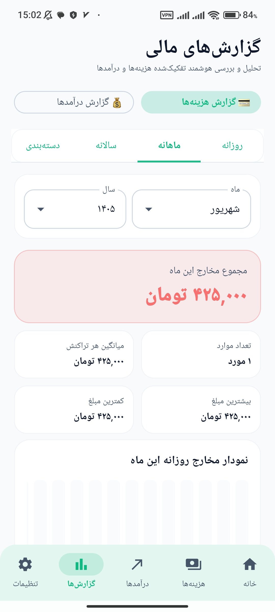
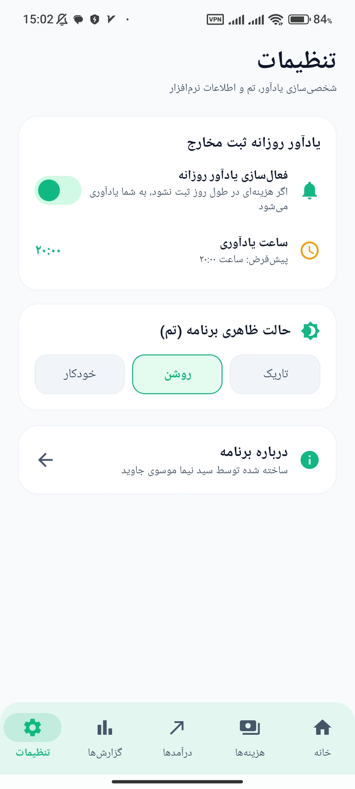

# 💰 poolyar

### مدیریت مالی شخصی، ساده و کاربردی

**poolyar** یک اپلیکیشن اندرویدی برای مدیریت درآمد و هزینه‌های روزمره است؛  
طراحی شده تا کنترل امور مالی را ساده، سریع و مرتب کند.

---

## ✨ امکانات

💵 **مدیریت درآمد و هزینه**  
ثبت و کنترل آسان تراکنش‌های مالی

📊 **گزارش‌های مالی**  
مشاهده و بررسی وضعیت هزینه‌ها و درآمدها

🗂️ **دسته‌بندی هزینه‌ها**  
مرتب‌سازی بهتر مخارج برای مدیریت دقیق‌تر

⚡ **سریع و ساده**  
رابط کاربری روان و کاربردی برای استفاده روزمره

---

## 📱 محیط برنامه

---

## 📥 دانلود برنامه

نسخه اندروید **poolyar** را دریافت کنید.

### 📲 دانلود مستقیم APK

[⬇️ دانلود poolyar](https://github.com/aremnvans-alt/poolyar/releases/download/v1.0.0/Poolyar-v1.0.0.apk)

---

## 📸 ارتباط با ما

### Instagram

📷 **@nima.001n**

[🔗 صفحه اینستاگرام](https://www.instagram.com/nima.001n/)

---

## 👨‍💻 سازنده

**سید نیما موسوی جاوید**

---

**poolyar**

